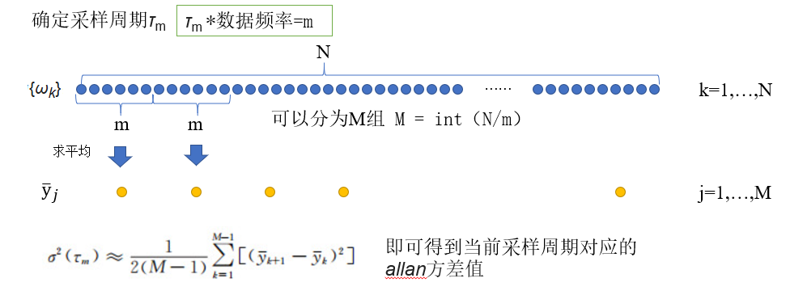
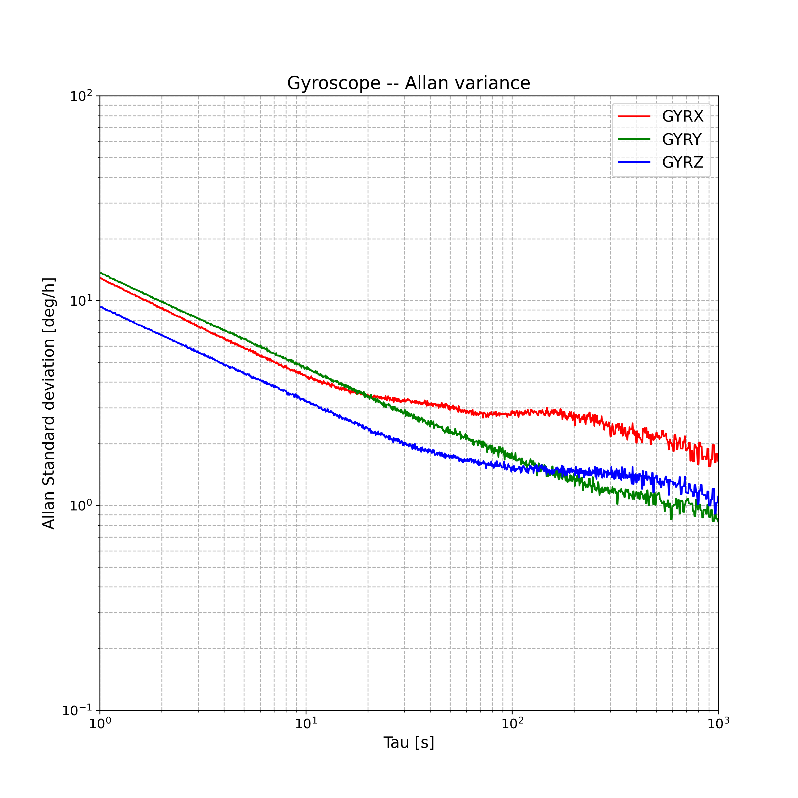

<!--
 * @Author: Withoutwaxwqy 2137697992@qq.com
 * @Date: 2025-02-20 16:41:10
 * @LastEditors: Withoutwaxwqy 2137697992@qq.com
 * @LastEditTime: 2025-02-20 16:48:48
 * @FilePath: \GNSSutils\IMU\allan\allan.md
 * @Description: 这是默认设置,请设置`customMade`, 打开koroFileHeader查看配置 进行设置: https://github.com/OBKoro1/koro1FileHeader/wiki/%E9%85%8D%E7%BD%AE
-->
# Allan 方差分析法
allan方差部分代码主要分为俩部分，allan方差计算方法&绘图，以及对应指标计算。

## allan方差计算
根据方差计算的时候：
采样是否重叠，可以分为标准方法，半重叠方差法，全重叠方差法；
以$\sigma$的选取，可以分为2次分布，log平均分布和自定义。
指标计算又可以分为数值法和拟合法。
**标准Allan方差**的计算过程
1. 以固定的采样周期$\tau$采集数据，得到长度为N的原始数据，记原始数据序列为{$ω_k$}；
1. 将样本数据每m个分一组，得M组数据；
1. 对每组数据取平均值，得到新的输出序列 $\bar{y}_i$
1. Allan方差的计算式为：
$\sigma(\tau_m)\approx \frac{1}{2(M-1)}\sum_{i=0}^{n}[(\bar{y}_{k+1}-\bar{y}_k)^2]$

图1 allan方差图示

allan方差计算得到不同采样${\tau_m}$对应的$\sigma(\tau_m)$

## allan方差绘图
allan方差绘图通常都是双log图，这样可以看出数据的长中短期误差特点

如何读懂allan方差图可以参考[严恭敏Allan方差分析的使用要点](https://zhuanlan.zhihu.com/p/556220562)或者[新手入门系列3——Allan方差分析方法的直观理解](http://i2nav.com/index/newListDetail_zw?newskind_id=13a8654e060c40c69e5f3d4c13069078&newsinfo_id=c2bb31af75944e5ab665dc23b60b5fba)。

## 随机游走项指标计算
随机游走项可以分为 陀螺：角度随机游走，零偏不稳定性，零偏稳定性；加速度计：速度随机游走，零偏不稳定性，零偏稳定性。具体计算方法可以分为斜率拟合法和数值法，斜率拟合法有具体的物理意义，参考《惯性仪器测试与数据分析》

